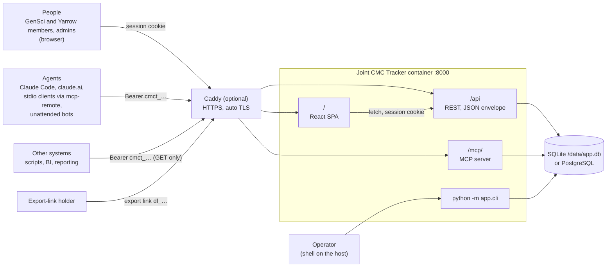
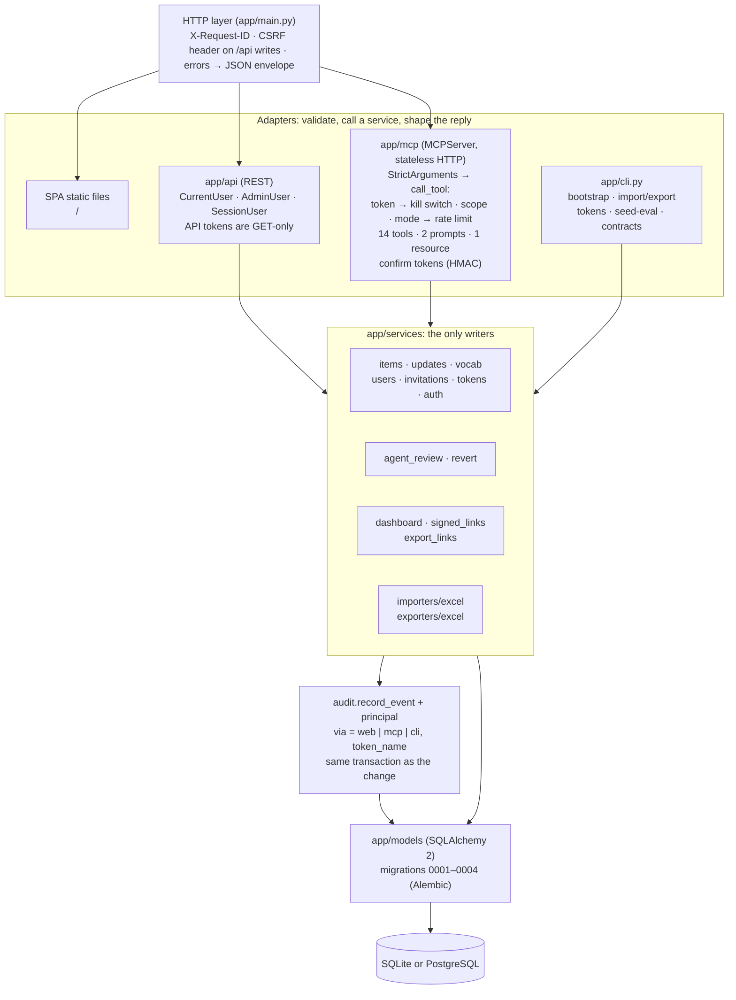
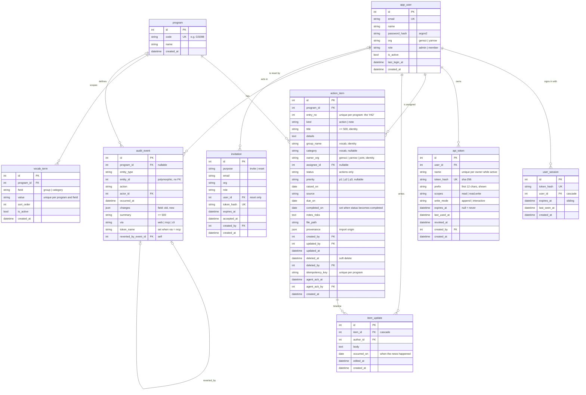
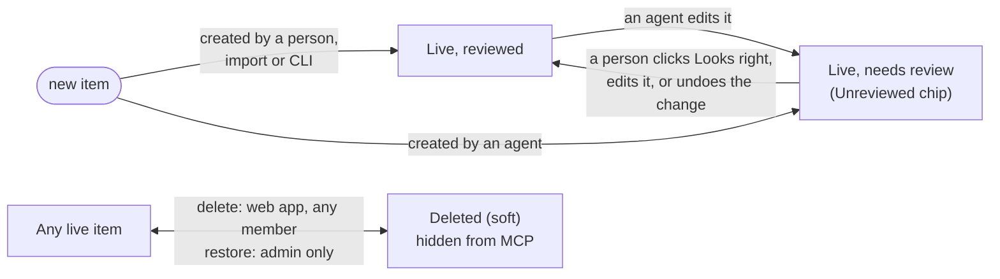
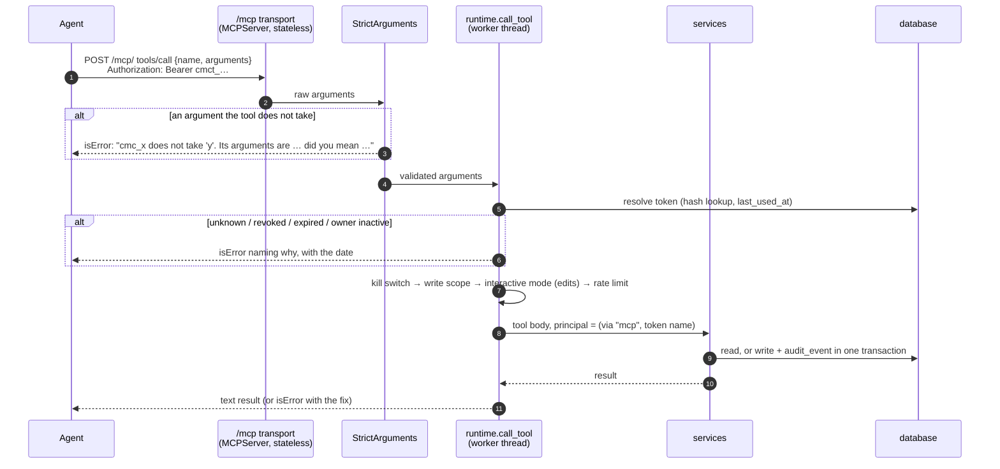
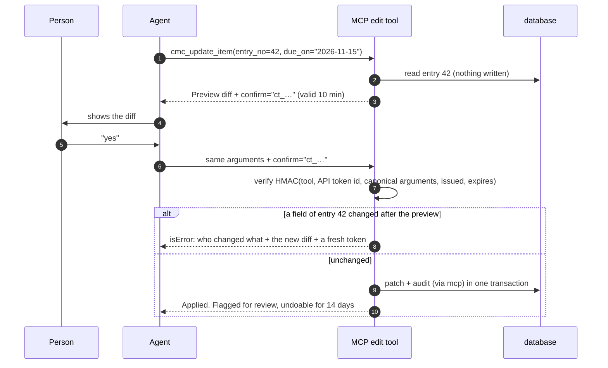
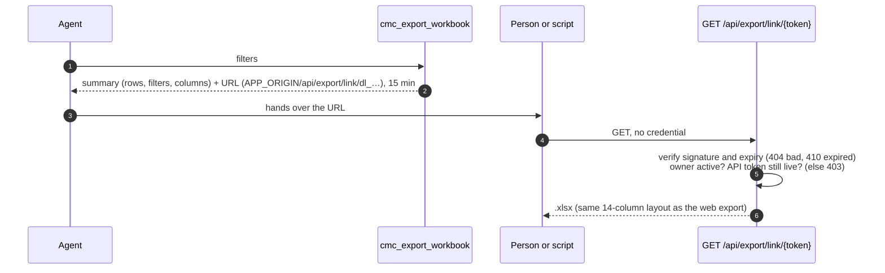
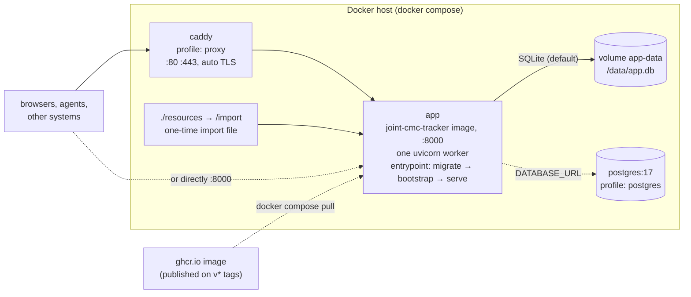

# Joint CMC Tracker — Architecture and Schema, As Built

Date: 2026-09-25
Describes: the code on `claude/optimistic-davinci-wpxhpl` after MCP phase 5
(app version `0.1.0`, migration head `0004`, MCP SDK `mcp` 2.2.0).
Audience: anyone connecting another system or an agent to the tracker.

This is a description of what exists, not a proposal. Where it and the code
disagree, the code wins. The two files in [`contracts/`](contracts/) are
generated from the code, and CI fails if they go stale, so they are exact:

| File | What it is | Regenerate |
|---|---|---|
| [`contracts/openapi.json`](contracts/openapi.json) | OpenAPI 3.1 for every REST endpoint, with request and response schemas | `cd backend && uv run python -m app.cli export-contracts` |
| [`contracts/mcp-manifest.json`](contracts/mcp-manifest.json) | The MCP server's instructions, and every tool (with `inputSchema` and annotations), resource and prompt, as `tools/list` returns them | same command |

Rendered diagrams are in [`diagrams/`](diagrams/) (`scripts/render-architecture-diagrams.sh`
rebuilds them from the Mermaid blocks in this file).

Related: design [`specs/2026-09-06-joint-cmc-tracker-design.md`](../specs/2026-09-06-joint-cmc-tracker-design.md) (v1),
[`specs/2026-09-19-mcp-agent-access-design.md`](../specs/2026-09-19-mcp-agent-access-design.md)
(MCP, with §14 listing where the build differs), and the earlier visual
[`docs/architecture/architecture-flow-map.html`](../../architecture/architecture-flow-map.html).

---

## 1. At a glance

- **One container, one process.** FastAPI (uvicorn, one worker) serves the REST
  API at `/api`, the MCP endpoint at `/mcp`, and the built React app at `/`.
  SQLite by default, PostgreSQL optional. Caddy in front for HTTPS, optionally.
- **Three front doors, one core.** The web app, the REST API and the MCP server
  are thin adapters. **Only the service layer writes the database, and every
  service write records its audit event in the same transaction.**
- **Every caller is a real person.** A browser session, or an API token that
  belongs to a user and acts as that user. There are no service accounts.
- **Agents write only through MCP.** The REST API is read-only to API tokens.
  MCP adds appends freely, previews and confirms edits, and has no delete.
- **Everything is traceable and reversible.** The audit trail records who, what,
  old → new, and how it arrived (`web`, `mcp` with the token's name, or `cli`);
  any field change can be undone for 14 days.

---

## 2. System context

<!-- diagram: 01-context -->


| Actor | Enters through | Credential | Can change data? |
|---|---|---|---|
| Member / admin in a browser | `/` then `/api` | `cmc_session` cookie + `X-Requested-With: fetch` on writes | Yes, within their role |
| Agent | `/mcp/` | `Authorization: Bearer cmct_…` | Yes, if the token has `write`: appends at once, edits only after a confirm, never delete |
| Other system | `/api` (GET) | `Authorization: Bearer cmct_…` | **No.** Any POST/PATCH/DELETE with a token is 403 |
| Export-link holder | `GET /api/export/link/{token}` | The link itself | No |
| Operator | `python -m app.cli …` | Shell access | Yes; recorded as `via="cli"` |

---

## 3. Inside the container

<!-- diagram: 02-components -->


| Package | Responsibility | Never does |
|---|---|---|
| `app/api` | HTTP shapes, auth dependencies, envelope | Write the DB directly |
| `app/mcp` | Tool schemas, argument validation with actionable errors, compact text rendering, confirm handshake | Write the DB directly; accept a cookie |
| `app/services` | Business rules, validation against vocabulary, audit in the same transaction | Know about HTTP or MCP |
| `app/services/principal.py` | Carries *how* a request arrived on `Session.info` so the audit row gets `via` and `token_name` without changing any service signature | — |
| `app/importers`, `app/exporters` | Excel in and out, in the sheet's original 14-column layout | — |
| `app/models` | Tables, constraints, indexes | — |
| `app/cli.py` | Bootstrap, admin, import/export, tokens, evaluation seed, contracts | — |

Frontend (`frontend/src`): React 19 + TypeScript + Vite 6, TanStack Query 5, routes
`/login`, `/accept-invite`, `/dashboard`, `/items`, `/items/:id`, `/board`,
`/tokens`, `/admin/{users,vocab,import,export}`. It talks only to `/api` with the
session cookie; its types are generated from `openapi.json`.

---

## 4. Data model

### 4.1 Entity relationships

<!-- diagram: 03-erd -->


### 4.2 Enumerations (enforced by CHECK constraints)

| Column | Values |
|---|---|
| `app_user.org` | `gensci`, `yarrow` |
| `app_user.role` | `admin`, `member` |
| `action_item.kind` | `action`, `note` |
| `action_item.status` | `open`, `in_progress`, `blocked`, `on_hold`, `completed`, `cancelled`; **NULL for notes, required for actions** |
| `action_item.priority` | `p1`, `p2`, `p3`, or NULL |
| `action_item.owner_org` | `gensci`, `yarrow`, `joint` |
| `api_token.write_mode` | `append`, `interactive` |
| `audit_event.via` | `web`, `mcp`, `cli` |
| `audit_event.entity_type` | `item`, `user`, `invitation`, `vocab_term`, `import`, `api_token` |
| `audit_event.action` | `created`, `updated`, `deleted`, `restored`, `status_changed`, `update_posted`, `update_edited`, `update_deleted`, `role_changed`, `deactivated`, `reactivated`, `invited`, `revoked`, `reset_link_issued`, `imported`, `acknowledged`, `reverted` |
| `invitation.purpose` | `invite`, `reset` |
| `vocab_term.field` | `group`, `category` |

Groups and categories are **programme vocabulary**, not enums: validated against
active `vocab_term` rows on write (inactive terms still match on read, because
old items carry them). Seeded groups: `General Issues`, `Gen1 (existing) CMC`,
`Gen2 (Process 2.0) CMC`; categories: `QA`, `QC`, `AS`, `AS/QC`, `DS`, `DP`,
`USPD`, `Legal`, `Non-clinical`.

### 4.3 Keys, indexes and invariants

| Rule | How it is held |
|---|---|
| `entry_no` is the human handle, unique per programme, never reused | `uq_action_item_program_id_entry_no`; next = max + 1, counting deleted items |
| An action has a status, a note has none | `ck_action_item_status_matches_kind` |
| A create retried with the same idempotency key files once | `uq_action_item_program_id_idempotency_key` (retry window `IDEMPOTENCY_TTL_HOURS`) |
| Deleting is soft and reversible | `deleted_at`/`deleted_by`; restore is admin-only; deleted items are invisible to MCP |
| Secrets are never stored in the clear | `token_hash` (SHA-256) for sessions, invitations and API tokens; `password_hash` argon2 |
| A timeline note belongs to one item | `item_update.item_id` ON DELETE CASCADE (never triggered: items are soft-deleted) |
| Every data change is audited in the same transaction | `services.audit.record_event` is called inside each service before its commit |
| An undo points at what it undid | `audit_event.reverted_by_event_id` → the `reverted` event |
| Lookups stay fast | `ix_action_item_program_status`, `ix_action_item_program_due`, `ix_item_update_item_occurred`, `ix_audit_event_entity`, `ix_audit_event_occurred_at`, `ix_api_token_user_id`, `ix_user_session_user_id`, `ix_invitation_email` |

Note the one naming mismatch: the Python attribute and every API field is
`group`; the column is `group_name` (`group` is reserved in SQL).

Migrations (`backend/alembic/versions`): `0001` initial schema, `0002` API
tokens and `audit_event.via`/`token_name`, `0003` idempotency and agent review,
`0004` revert link. All run on SQLite and PostgreSQL; CI applies and reverts
them on PostgreSQL 17.

### 4.4 The audit event, the record integrations should read

```json
{
  "id": 912,
  "entity_type": "item",
  "entity_id": 57,
  "action": "status_changed",
  "actor_id": 4,
  "occurred_at": "2026-09-24T14:02:11",
  "changes": {"status": {"old": "in_progress", "new": "blocked"}},
  "summary": "changed status of #6 from In progress to Blocked",
  "via": "mcp",
  "token_name": "Claude Code",
  "reverted_by_event_id": null
}
```

- `changes` holds only the fields that changed, each as `{old, new}`. Posting an
  update records `{"update_id": {"old": null, "new": <id>}}`.
- `entity_id` is polymorphic (no foreign key); join by `entity_type`.
- Field-change actions (`updated`, `status_changed`, `reverted`, `deleted`,
  `restored`) are what make a pending confirm token stale.
- An item "needs agent review" when it has a `via='mcp'` event with action
  `created`, `updated` or `status_changed` later than its `agent_ack_at`. There
  is no stored flag; it is derived.

### 4.5 Item lifecycle and agent review

<!-- diagram: 04-item-states -->


Status moves freely between the six values (no enforced workflow);
`completed_on` is set when the status becomes `completed` and cleared when it
leaves. `kind` can flip between action and note in the web app only, which sets
or clears the status.

---

## 5. Identity, credentials and permissions

### 5.1 Credentials

| Credential | Format | Stored as | Lifetime | Where it works |
|---|---|---|---|---|
| Session | cookie `cmc_session` (httpOnly, SameSite=Lax, Secure when `APP_ORIGIN` is https) | SHA-256 in `user_session` | 72 h, sliding (`SESSION_TTL_HOURS`) | `/api` |
| API token | `cmct_` + random; first 12 chars are the visible prefix | SHA-256 in `api_token` | `MCP_TOKEN_TTL_DAYS` (90); admins may create non-expiring | `/mcp/` (read and write), `/api` (GET only) |
| Invitation / reset link | one-time token in a URL | SHA-256 in `invitation` | `INVITE_TTL_DAYS` (7) | `POST /api/auth/accept-invite` |
| Confirm token | `ct_<base64url {i, x}>.<32-hex HMAC>` | Nothing (stateless) | `MCP_CONFIRM_TTL_MINUTES` (10) | The same MCP edit tool, same arguments, same API token |
| Export link | `dl_<base64url payload>.<32-hex HMAC>` in a URL | Nothing (stateless) | 15 minutes | `GET /api/export/link/{token}` |

A token is refused if unknown, revoked, expired, or its owner is deactivated;
MCP tells the holder which, with the date.

### 5.2 What each caller may do

| Action | Member (web) | Admin (web) | Token `read` | Token `read,write` `append` | Token `read,write` `interactive` |
|---|---|---|---|---|---|
| Read items, updates, history, activity, dashboard, vocab, directory | ✓ | ✓ | ✓ REST GET + MCP | ✓ | ✓ |
| Post a timeline update | ✓ | ✓ | ✗ | ✓ `cmc_post_update` | ✓ |
| Create an item | ✓ | ✓ | ✗ | ✓ `cmc_create_item` | ✓ |
| Change status / live fields | ✓ | ✓ | ✗ | ✗ | ✓ after a confirm |
| Change identity (title, group, owner org, kind) | ✓ | ✓ | ✗ | ✗ | ✗ (web only) |
| Edit or delete a timeline update | own only | any | ✗ | ✗ | ✗ |
| Delete an item | ✓ (soft) | ✓ | ✗ | ✗ | ✗ |
| Restore an item | ✗ | ✓ | ✗ | ✗ | ✗ |
| Acknowledge agent work, undo a change | ✓ | ✓ | ✗ | ✗ | ✗ |
| Manage own API tokens | ✓ | ✓ (anyone's) | ✗ | ✗ | ✗ |
| Users, invitations, vocabulary, Excel import | ✗ | ✓ | ✗ | ✗ | ✗ |
| Export workbook | ✓ | ✓ | ✓ REST + MCP link | ✓ | ✓ |

Server-wide switches: `MCP_WRITES_ENABLED=false` makes every token read-only;
`MCP_ENABLED=false` removes `/mcp`.

---

## 6. REST API (`/api`)

Full schemas: [`contracts/openapi.json`](contracts/openapi.json); interactive
docs at `/api/docs` on a running server.

### 6.1 Conventions

- **Envelope** on every JSON response:
  `{"success": bool, "data": …, "error": {"code", "message", "fields", "request_id"} | null, "meta": {"total", "page", "limit"} | null}`.
  `GET /api/export/*` return the xlsx bytes instead.
- **Writes** (POST/PATCH/DELETE under `/api`) need the header
  `X-Requested-With: fetch` (CSRF guard), else 403 `csrf_missing`.
- **Tracing:** send or receive `X-Request-ID`; it is echoed and logged.
- **Errors:** `401 unauthenticated`, `403 forbidden`, `404 not_found`,
  `409 conflict`, `410 link_expired`, `422 validation_error` (with `fields`),
  `429 rate_limited` (login), `500 internal_error` (quote the request id).
- **Ids:** REST uses the internal `id`; people and MCP use `entry_no`. Both are
  in every item payload.
- **Dates** are ISO `YYYY-MM-DD`; timestamps are naive UTC ISO 8601.

### 6.2 Endpoints

Auth column: **any** = session or token (tokens GET only), **session** = browser
session only (tokens refused), **admin** = admin session, **none** = public.

| Method | Path | Auth | Purpose |
|---|---|---|---|
| GET | `/api/health` | none | `{status, version, database}` |
| POST | `/api/auth/login` | none | Email + password → session cookie (rate limited) |
| POST | `/api/auth/logout` | none | Clear the session |
| GET | `/api/auth/me` | any | The current user |
| POST | `/api/auth/accept-invite` | none | Accept an invitation or reset; sets a password |
| GET | `/api/items` | any | List/filter: `status[]`, `priority[]`, `group[]`, `category[]`, `owner_org[]`, `kind`, `assignee_id`, `due_before`, `due_after`, `q`, `needs_agent_review`, `sort`, `direction`, `page`, `limit` |
| POST | `/api/items` | any (session) | Create an item |
| GET | `/api/items/{id}` | any | One item (`ItemOut`) |
| PATCH | `/api/items/{id}` | any (session) | Partial update, any field |
| DELETE | `/api/items/{id}` | any (session) | Soft delete |
| POST | `/api/items/{id}/restore` | admin | Undelete |
| GET | `/api/items/{id}/history` | any | The item's audit events, with `can_undo` |
| POST | `/api/items/{id}/ack` | session | Mark agent work as reviewed |
| GET | `/api/items/{id}/updates` | any | Timeline |
| POST | `/api/items/{id}/updates` | any (session) | Post a timeline update |
| PATCH | `/api/items/{id}/updates/{update_id}` | any (session) | Edit (author or admin) |
| DELETE | `/api/items/{id}/updates/{update_id}` | any (session) | Delete (author or admin) |
| GET | `/api/activity` | any | Programme-wide audit feed |
| POST | `/api/activity/{event_id}/revert` | session | Undo a field change (14 days, if untouched since) |
| GET | `/api/dashboard/summary` | any | Counts, needs-attention lists, breakdowns, agent-unreviewed |
| GET | `/api/vocab` | any | Groups and categories (`?field=`) |
| POST, PATCH | `/api/vocab`, `/api/vocab/{term_id}` | admin | Manage vocabulary |
| GET | `/api/users/directory` | any | Assignable people (id, name, org) |
| GET, PATCH | `/api/users`, `/api/users/{user_id}` | admin | Manage users |
| POST | `/api/users/{user_id}/reset-link` | admin | Issue a password-reset link |
| GET, POST, DELETE | `/api/invitations[/{invitation_id}]` | admin | Invite people |
| GET, POST, DELETE | `/api/tokens[/{token_id}]` | session | Manage API tokens (`?all=true` for admins) |
| POST | `/api/import/excel/preview`, `/api/import/excel/commit` | admin | Two-step Excel import |
| GET | `/api/export/excel` | any | The filtered workbook (same filters as `/api/items`) |
| GET | `/api/export/link/{token}` | none (the link) | The workbook an MCP export link names |

"any (session)" marks writes: a token sent there gets 403, by design.

---

## 7. MCP server (`/mcp/`)

Full schemas: [`contracts/mcp-manifest.json`](contracts/mcp-manifest.json).

### 7.1 Transport and conventions

- **Streamable HTTP**, stateless, JSON responses (no SSE stream needed), at
  `POST /mcp/` (note the trailing slash). Protocol version negotiated by
  `initialize`; each request is independent, so `tools/list` and `tools/call`
  work without a session id.
- **Auth:** `Authorization: Bearer cmct_…` on every request. No cookie.
- **Results are text** (`content[0].type = "text"`), written for a model to
  read: one line per item in lists, everything for one item in detail. There is
  no `structuredContent`.
- **Errors** are tool results with `isError: true` and a sentence saying what to
  do next (valid values, "did you mean", which tool to call). An argument a tool
  does not take is refused by name, never silently dropped.
- **Items are addressed by `entry_no`.** Deleted items do not exist here.
- **Rate limits:** per token, 600 reads and 60 writes a minute (in memory, per
  process).
- **Host check** (`MCP_ALLOWED_HOSTS`) is off unless configured.

### 7.2 Tools

| Tool | Class | Annotations | Key arguments (`*` required) |
|---|---|---|---|
| `cmc_whoami` | read | read-only, idempotent | — |
| `cmc_list_vocabulary` | read | read-only, idempotent | — |
| `cmc_search_items` | read | read-only, idempotent | `q`, `status[]`, `priority[]`, `group[]`, `category[]`, `owner_org[]`, `kind`, `assignee_id`, `due_before`, `due_after`, `limit` (≤100), `page`, `sort`, `direction` |
| `cmc_get_item` | read | read-only, idempotent | `entry_no*`, `include_updates` (≤50), `include_history` |
| `cmc_list_updates` | read | read-only, idempotent | `entry_no*`, `limit` (≤200), `page` |
| `cmc_get_item_history` | read | read-only, idempotent | `entry_no*` |
| `cmc_needs_attention` | read | read-only, idempotent | `bucket` (`overdue`\|`due_soon`\|`stale`\|`all`), `owner_org`, `assignee_id` |
| `cmc_list_activity` | read | read-only, idempotent | `since`, `actor_id`, `entity_type`, `via`, `limit`, `page` |
| `cmc_export_workbook` | read | read-only, idempotent | the search filters (kind filter is `item_kind`), `kind` (`items`; `period_report` not yet available), `from_date`, `to_date` |
| `cmc_post_update` | write (append) | not read-only, not idempotent | `entry_no*`, `body*`, `occurred_on`, `dry_run` |
| `cmc_create_item` | write (append) | not read-only, not idempotent | `title*`, `group*`, `owner_org*`, `kind`, `status`, `priority`, `category`, `due_on`, `raised_on`, `details`, `notes_risks`, `assignee_id`, `source`, `file_path`, `idempotency_key`, `confirm_new`, `dry_run` |
| `cmc_set_status` | edit (confirm) | not read-only, idempotent | `entry_no*`, `status*`, `note`, `confirm` |
| `cmc_update_item` | edit (confirm) | not read-only, not idempotent | `entry_no*`, `due_on`, `priority`, `category`, `assignee_id` (0 unassigns), `details`, `notes_risks`, `file_path`, `confirm` (empty string clears) |
| `cmc_apply_batch` | edit, or append if it only posts | not read-only, not idempotent | `changes*` (≤50 × `{entry_no, status, due_on, priority, category, assignee_id, details, notes_risks, file_path, post, occurred_on}`), `confirm` |

Class decides who may call it: **read** needs `read`; **append** needs `write`;
**edit** needs `write` and `interactive` mode. No tool deletes, restores,
manages people, vocabulary or tokens, or imports.

Resource: `cmc://program/briefing` (conventions both teams follow; readable
without a token, holds no item data). Prompts: `weekly_update(group)`,
`meeting_minutes_to_changes(minutes)`.

### 7.3 One tool call, end to end

<!-- diagram: 05-mcp-call -->


### 7.4 The confirm handshake for edits

<!-- diagram: 06-confirm -->


Changing any argument, using another API token, another tool, or a token past
its expiry fails the signature. A batch is one preview, one token, and applies
all changes or none.

### 7.5 Export link

<!-- diagram: 07-export -->


---

## 8. Integrating with the tracker

### 8.1 Pick the door

| You want to… | Use | Credential |
|---|---|---|
| Let an LLM agent read and update items | MCP `/mcp/` | API token, `read,write`, `interactive` if a person is in the loop, `append` if not |
| Pull data into another system (BI, reporting, sync out) | REST `GET /api/items`, `/api/activity`, `/api/items/{id}/updates` | API token, `read` |
| Hand someone a spreadsheet | MCP `cmc_export_workbook`, or REST `GET /api/export/excel` | as above |
| Push data in from another system | MCP `cmc_create_item` / `cmc_post_update` with `idempotency_key` | API token, `read,write`, `append` |
| Bulk load a spreadsheet | Admin web import, or `python -m app.cli import-excel` | admin / shell |

### 8.2 Rules of the road

1. **Create one token per integration**, named for it (`"Weekly digest bot"`,
   `"BI nightly sync"`). The name appears on every change it makes and is how
   people find and revoke it.
2. **Use `entry_no` to talk to people and MCP; use `id` for REST.** Both are
   stable; entry numbers are never reused.
3. **Make creates retry-safe** with `idempotency_key` (≤64 chars, unique per
   intended item). A repeat within 24 h returns the original.
4. **Sync incrementally from the audit feed**: poll `GET /api/activity` (or
   `cmc_list_activity since=`) and filter by `entity_type`, `via`, or actor.
   There are **no webhooks** yet.
5. **Validate against vocabulary first**: `cmc_list_vocabulary` or
   `GET /api/vocab` + `GET /api/users/directory`. Unknown groups, categories,
   statuses or people are refused, with the valid values listed.
6. **Expect a person in the loop for edits.** An `interactive` token's edit is a
   preview until confirmed; an `append` token cannot edit at all. Build flows
   around "propose, then confirm" rather than silent updates.
7. **Treat MCP text as for models, REST JSON as for programs.** Do not parse MCP
   output in code; read the REST API instead.
8. **Stay within the rate limits** (600 reads, 60 writes per minute per token)
   and back off on the error.

### 8.3 Compatibility promise

Tool names, required arguments and REST paths are treated as an API: within a
major version, changes are additive only (new optional arguments, new tools,
new response fields). `cmc_whoami` and `GET /api/health` report the server
version. The contracts in [`contracts/`](contracts/) are the reference, and a
diff of them between two versions is the change list.

---

## 9. Deployment and configuration

<!-- diagram: 08-deployment -->


| Variable | Default | Meaning |
|---|---|---|
| `SECRET_KEY` | — (required) | Signs sessions, confirm tokens and export links |
| `DATABASE_URL` | `sqlite:////data/app.db` | or `postgresql+psycopg://…` |
| `APP_ORIGIN` | `http://localhost:8000` | Public URL; invitation and export links are built from it |
| `PROGRAM_CODE`, `PROGRAM_NAME` | `GS098`, … | The single programme this instance serves |
| `ADMIN_EMAIL`, `ADMIN_PASSWORD`, `ADMIN_ORG` | —, —, `gensci` | First admin, created on first start |
| `INITIAL_IMPORT_PATH`, `INITIAL_IMPORT_OVERRIDES` | —, `{}` | One-time import into an empty programme |
| `SESSION_TTL_HOURS` | `72` | Sliding browser session |
| `INVITE_TTL_DAYS` | `7` | Invitation and reset links |
| `LOGIN_ATTEMPTS_PER_MINUTE` | `5` | Login throttle |
| `DUE_SOON_DAYS`, `STALE_DAYS` | `14`, `14` | Needs-attention thresholds |
| `MCP_ENABLED` | `true` | Serve `/mcp` |
| `MCP_WRITES_ENABLED` | `true` | Kill switch for all agent writes |
| `MCP_DEFAULT_WRITE_MODE` | `interactive` | Mode for new tokens |
| `MCP_TOKEN_TTL_DAYS` | `90` | Default token expiry |
| `MCP_RATE_READS_PER_MIN`, `MCP_RATE_WRITES_PER_MIN` | `600`, `60` | Per token |
| `MCP_CONFIRM_TTL_MINUTES` | `10` | Confirm-token validity |
| `AGENT_UNDO_DAYS` | `14` | Undo window |
| `IDEMPOTENCY_TTL_HOURS` | `24` | Create-retry window |
| `MCP_ALLOWED_HOSTS` | empty | Enables the Host-header check when set |
| `STATIC_DIR`, `LOG_LEVEL` | `static`, `info` | — |

---

## 10. Limits and open items

| Limit | Consequence for an integration |
|---|---|
| One programme per instance (`PROGRAM_CODE`) | A second programme is a second deployment |
| No webhooks or event stream | Poll the activity feed |
| Rate limits are in memory, per process | Correct for the one-worker image; revisit before adding workers |
| MCP export `kind="period_report"` | Refused until the V2.0 period-report builder exists |
| No Audit log page in the web app | The data is there (`via`, `token_name`), filterable through `/api/activity` and `cmc_list_activity` |
| Tokens are managed only from a browser session | Provisioning an integration needs a person (or the CLI on the server) |
| Timestamps are naive UTC | Treat them as UTC |
| Exports cap at 10,000 rows | Filter, or page through `/api/items` |
